<a href="https://adpsagent.com/zh/workshops/">研讨会</a>/行动 Action

<header class="publication-head">

ADPS Agent 设计模式系列研讨会

<h1>ADPS 设计模式系列研讨会 · 行动模块第一次研讨会</h1>

Plan 与 ReAct、结构化计划、工具准入、GUI 行动、沙箱与事件驱动。

<time datetime="2026-08-06">2026-08-06</time>

</header>

<table>
<thead>
<tr>
<th style="text-align: left;"></th>
<th style="text-align: left;"></th>
</tr>
</thead>
<tbody>
<tr>
<td style="text-align: left;"><strong>主持人</strong></td>
<td style="text-align: left;">茹炳晟</td>
</tr>
<tr>
<td style="text-align: left;"><strong>核心参与者</strong></td>
<td style="text-align: left;">李庆丰、张栋、罗军、唐洪山、王伟、Pylon Peng、任磊达</td>
</tr>
</tbody>
</table>

2026 年 8 月 6 日，ADPS 组织了行动模块第一次专题研讨。讨论聚焦 Agent 如何把判断变成外部系统可以接受、检查和恢复的动作。与会者从代码开发、安全扫描、GUI 操作、研发平台、多模态评测和多 Agent 协作等场景，展开了近两小时的技术讨论。

会议结束时，Event-Driven 的坐标和 Plan DSL 的边界仍未定。这两个问题直接关系 A1–A5 的适用边界，也影响 C6 编舞的候选地位。

## 1. Plan 与 ReAct 根据任务风险分流

代码生成、评审、测试和修复可以构成循环。循环能运行的前提是明确的验收条件：测试是否通过，修复是否解决原问题，代码是否进入人工复核。模型能力影响循环效率，验收条件决定它停在哪里。

复杂任务的 Plan 更接近一张可恢复的导航图。每个步骤需要状态、产物和检查点，任务中断后才能从已确认的进度继续。小型、低风险任务可以让模型直接 ReAct；长程任务、生产环境或不可逆动作需要显式计划。

离线创意环境和在线生产环境也需要分开。前者允许试错，可以给模型更大的探索空间；后者需要固定流水线、结构化输入输出和发布节奏。线上数据可以驱动离线修订，新版本通过测试和审查后再进入生产。

选型时同时检查任务长度、动作后果、中断恢复要求和环境容错性，再决定 Plan 的粒度。

<figure class="workshop-diagram"><figcaption>结构化计划先通过编译检查，再由 Executor 和护栏三明治执行。</figcaption></figure>

## 2. 结构化 Plan 是可编译的执行合同

<strong>茹炳晟提出“对 Plan 本身进行编译”。</strong>在真正调用工具以前，先检查计划是否合法、依赖是否完整、约束是否满足、是否存在重复步骤和不经济的顺序。王伟与 Pylon PENG 随后把权限、并发冲突和跨项目调度补进这组编译检查。

Plan 可以表达为结构化数据或领域 DSL，然后在执行前检查合法性、依赖、约束和成本。一份可执行 Plan 至少需要步骤标识、依赖关系、预期产物、验收条件、允许工具和恢复位置。结构完整后，系统才能发现可并行步骤、重复读取和不合理的执行顺序。

领域 DSL 的实践表明，静态分析、供应链扫描等工具使用不同的命令和语义，同一份 DSL 很难跨领域直接复用。白皮书因此将稳定核心放在 PlanStep 合同，领域动词、工具参数和验收器交给适配层。

## 3. 行动接口需要明确的优先级

固定动线、动态 GUI 推理和端云协同可以组合使用。短程任务使用已验证的静态路径；复杂任务保留动态识别与编排；端侧先做粗粒度理解和信息压缩，减少云端往返。具备标准接口时，Skill 或 API 提供更稳定的参数和回执；GUI 覆盖尚未开放接口的能力。

一类评测平台将能力组织为主 Agent、专职子 Agent、Skill 和 CLI。Skill 按需加载，子 Agent 只看到当前职责所需的工具。Coding 与测试使用独立的执行与评审角色，避免同一个路径同时生成和给自己验收。

这两类实践给 A1 和 A5 提供了共同判断：结构化接口优先，能力按职责披露，GUI 作为有明确验收和授权的兼容路径。

## 4. 工具执行离不开沙箱和发布门禁

线上流水线需要限制在已测试的格式、工具和置信范围内。大模型可以参与分类和预处置，确定性流程继续掌握最终发布。数据飞轮用于线下修订规则和流程，避免运行期自我改写生产合同。

一类研发平台在意图识别后决定是否启动沙箱。只要涉及命令或本地工具，任务会带着角色、Skill、提示词和 Agent 配置进入动态沙箱；推理与调度保留在主流程。这种分离将命令副作用收口到可观测、可回收的边界中。

这部分讨论直接支持 A4 护栏三明治：执行前检查权限、参数和环境，工具在隔离边界中运行，执行后验证产物和副作用。

## 5. 生产流程通常组合多种拓扑

<strong>Pylon PENG 展示的工作流在一个上午同时调度六个子 Agent。</strong>它们并行扫描多个任务源，主 Agent 汇总后按代码库路由，再进入设计、编码、质量检查和修复循环。这个例子没有被硬塞进某一个格子，因为每个阶段承担的控制关系不同。

一类研发支撑系统同时使用路由、多路检索、子 Agent、沙箱和循环校验。短任务可以直接处理，需要澄清和上下文收集的任务先形成计划。底层索引和知识服务提供候选材料，路由层选择访问路径，执行动作进入沙箱。

另一条跨项目开发流程让子 Agent 并行扫描任务源，由主 Agent 汇总和编排，再通过路由将任务送往相应代码库，设计和质量检查通过循环收敛。人主要在设计确认和最终验收两个节点介入。

这两个案例显示，拓扑用于描述局部控制结构。一条生产流程可以在不同阶段使用并行、路由、编排、循环和层级，不需要给整个系统贴一个拓扑标签。

## 6. Event-Driven 提供触发与传递，编舞描述协作结构

<strong>Pylon PENG 追问 Event-Driven 是否应成为新拓扑，任磊达补充了 Agent 通过事件相互唤醒的实践。</strong>讨论最后保留了两个问题：事件决定工作何时出现、怎样可靠送达；拓扑决定工作出现以后由谁持有计划、怎样分支和收口。

研讨会提出 Event-Driven 是否应成为第七种执行拓扑，并形成了一个关键区分：Loop 通过终止条件决定是否继续，事件通过触发条件决定何时开始。队列还有持久化价值：下游 Agent 暂时不可用时，事件仍可留在待处理状态。已有多 Agent 实践通过事件互相通知并引发后续行动。

对“第七拓扑”的分类质疑在于：事件说明任务如何被触发和传递，任务启动后仍然会呈现链式、路由、并行、编排、循环或层级结构。事件监听也可以作为感知外部变化的机制。

本轮白皮书采用以下关系：

- **事件驱动**定义触发、传递、等待和重放机制。
- **执行拓扑**定义任务启动后控制如何展开。
- **编舞**定义没有中央编排者时，多个 Agent 如何依靠本地规则和事件形成整体协作。

研讨会记录了多 Agent 使用事件协作的现有实践。C6 编舞继续保持候选地位，Event-Driven 暂不增加为第七个核心拓扑列。

## 7. 关键概念

<table>
<thead>
<tr>
<th style="text-align: left;">概念</th>
<th style="text-align: left;">本场定义</th>
<th style="text-align: left;">当前地位</th>
</tr>
</thead>
<tbody>
<tr>
<td style="text-align: left;"><strong>PlanStep 合同</strong></td>
<td style="text-align: left;">以步骤标识、依赖、产物、验收、允许工具和恢复位置描述一个可执行工作单元</td>
<td style="text-align: left;">已进入 A2</td>
</tr>
<tr>
<td style="text-align: left;"><strong>行动接口优先级</strong></td>
<td style="text-align: left;">领域 API / Skill 优先，其次是受控 CLI，GUI 作为带证据和授权的兼容路径</td>
<td style="text-align: left;">行动总纲的选型规则</td>
</tr>
<tr>
<td style="text-align: left;"><strong>工具准入</strong></td>
<td style="text-align: left;">在工具选择后、执行前综合检查权限、风险、状态新鲜度和参数来源</td>
<td style="text-align: left;">A1 与 A4 的衔接机制</td>
</tr>
<tr>
<td style="text-align: left;"><strong>事件—拓扑分离</strong></td>
<td style="text-align: left;">事件描述触发与传递，拓扑描述任务启动后的控制结构</td>
<td style="text-align: left;">模块级分类规则</td>
</tr>
<tr>
<td style="text-align: left;"><strong>动作证据链</strong></td>
<td style="text-align: left;">用 ActionEvent、业务账本、外部回执和 checkpoint 证明动作及其结果</td>
<td style="text-align: left;">跨行动与治理的实现要求</td>
</tr>
</tbody>
</table>

这些概念解释 A1–A5 怎样在同一运行时协作。它们不增加新的行动模式编号。

## 8. 白皮书修订

1. **A1 工具调度**增强能力注册、候选缩减、接口优先级和 GUI 兼容路径的准入条件。
2. **A2 规划执行**将 Plan 收紧为可版本化的结构化合同，步骤带依赖、产物、验收条件和恢复位置。
3. **A3 提示链**以结构化产物连接步骤，每一段通过后再把产物交给下游。
4. **A4 护栏三明治**明确执行前检查、隔离执行和执行后验证，命令类工具优先进入沙箱。
5. **A5 最简工具集**使用职责边界和渐进披露控制工具面，避免全量工具元数据占用上下文。
6. **C6 编舞**继续保持候选扩展地位，后续需要补充跨认知功能的独立证据和失效记录。

## 9. 后续问题

- Plan DSL 哪些字段可以跨领域稳定，哪些必须留在领域适配层？
- 任务从 ReAct 升级为显式 Plan 的可测量阈值是什么？
- GUI 兼容路径需要哪些授权、界面证据和失败回执？
- 沙箱如何将命令、文件变更、网络访问和资源消耗连到同一条 Action trace？
- Event-Driven 在感知、治理和编舞之间的接口应如何定义？

## 相关页面

- [A1 工具调度](https://adpsagent.com/zh/patterns/a1-tool-dispatch/)
- [A2 规划执行](https://adpsagent.com/zh/patterns/a2-plan-and-execute/)
- [A3 提示链](https://adpsagent.com/zh/patterns/a3-prompt-chaining/)
- [A4 护栏三明治](https://adpsagent.com/zh/patterns/a4-guardrail-sandwich/)
- [A5 最简工具集](https://adpsagent.com/zh/patterns/a5-minimal-tool-set/)
- [C6 编舞](https://adpsagent.com/zh/patterns/c6-choreography/)
- [白皮书贡献者](https://adpsagent.com/zh/founders/#white-paper-contributors)

公开稿保留研讨问题与工程细节；涉及内部系统的信息采用脱敏表述。会后采纳的结论见<a href="https://adpsagent.com/zh/patterns/action/">行动 Action模块总纲</a>与各模式规范。

<!-- PAGE-CHRONICLE:START -->

<section aria-labelledby="page-chronicle-title" class="page-chronicle">
<h2 id="page-chronicle-title">溯源记录</h2>
<dl>

<dt>来源记录</dt><dd>ADPS 设计模式系列研讨会 · 行动模块第一次研讨会；会议日期 <time datetime="2026-08-06">2026-08-06</time></dd>

<dt>来源日期</dt><dd><time datetime="2026-08-06">2026-08-06</time></dd>

<dt>本页首次公开</dt><dd><time datetime="2026-08-09">2026-08-09</time></dd>

</dl>

<a href="https://adpsagent.com/zh/chronicle/#workshops-action-2026-08-06">在 ADPS Chronicle 中查看</a>

</section>

<!-- PAGE-CHRONICLE:END -->
