<p style="font-size: 0.9rem; color: var(--color-text-faint); margin-bottom: 1.75rem;"><a href="https://adpsagent.com/zh/workshops/">研讨会</a><span style="margin: 0 0.45rem;">/</span>治理 Governance</p>

<header class="publication-head">
<p class="publication-series">ADPS 设计模式系列研讨会</p>
<h1>治理模块第一次研讨会</h1>
<p class="publication-deck">动作控制、Agent 群体与生命周期怎样接入同一套治理结构。</p>
</header>

<p class="publication-date">2026-08-18</p>

<table>
<thead>
<tr>
<th style="text-align: left;"></th>
<th style="text-align: left;"></th>
</tr>
</thead>
<tbody>
<tr>
<td style="text-align: left;"><strong>主持人</strong></td>
<td style="text-align: left;">姜宁、黄佳</td>
</tr>
<tr>
<td style="text-align: left;"><strong>核心研讨嘉宾</strong></td>
<td style="text-align: left;">马阳阳、张栋、李庆丰、龙波、徐一博、伍斌</td>
</tr>
</tbody>
</table>

讨论议题包括危险工具调用、Agent 群体、治理生命周期和组织责任。形成的结论改变了治理模块与双轴矩阵的关系：可观测性移到横切面，治理增加生命周期，单体控制连接到注册、策略、执行与证据组成的控制平面。

## 1. 当前动作合规，长程目标仍可能漂移

讨论区分两个尺度。动作治理检查当前工具、参数、权限和前置条件；目标治理持续比较原始目标、当前计划、已完成产物和真实业务结果。一个长程 Agent 可以每一步都通过局部规则，数十轮后却把大量时间投入到无关细节。

治理目标分为授权、问责和限界。授权回答能不能做，问责回答发生了什么、谁承担责任，限界假设前两者仍可能失效，提前规定最大影响。

<figure class="workshop-diagram"><figcaption>动作治理约束当前调用，目标治理检查长程任务是否仍在推进。</figcaption></figure>

## 2. 沙箱回答“触及哪里”，业务授权回答“这次能不能做”

<p class="workshop-field-note"><strong>姜宁用 DeerFlow 的代码演进回答了“沙箱以后还缺什么”。</strong>沙箱限制进程、网络和文件；pre-tool middleware 仍要取得可信 Principal，并按当前工具、参数和资源做业务裁决。装配时和调用时共用一套策略来源，才能避免模型看不见却仍可绕路调用，或看得见却在执行时缺少授权。</p>

一个现场问题是：已经把 Agent 放进沙箱，为什么还需要治理层？沙箱隔离文件、网络和进程，却不知道当前用户是否有权修改这条业务记录，也不知道同一个工具的某组参数是否需要审批。

两层授权分别处理工具可见性和单次调用：

- **装配时过滤**把没有权限的工具从模型可见集合中移除。
- **运行时复核**按本次身份、参数、资源、环境、配额和审批重新裁决。

同一个薪酬工具可以得到三种结果：读取本人薪酬信息符合身份与资源范围，可以直接执行；修改一名员工的津贴需要提交确定参数后等待审批；批量付款超过当日限额，即使审批人在线也会被硬边界拒绝。沙箱没有能力区分这三种业务语义。

[DeerFlow Guardrail 公开案例](https://adpsagent.com/zh/cases/deerflow-guardrail/)提供了可以逐个 PR 核对的实现线索：统一 pre-tool middleware、可信 Principal、RunJournal、独立 RBAC Provider，以及装配与调用共用策略实例。

## 3. “装配哪些工具”不能只看一张 allowlist

会议中被反复追问的细节是：完成一个任务时，Agent 到底装配哪些工具？答案来自多层交集，而非一张全局表：

```
task needs
  ∩ tool group
  ∩ agent/subagent allow-deny
  ∩ active skill policy
  ∩ principal authorization
  = model-visible tools
```

deferred discovery 只把低频工具延后加载，不代表已经取得调用权限。工具被发现后仍要进入运行时授权。

这也回答了“一个任务应装配多少工具”。完成津贴变更只需要员工查询、政策查询、变更准备、审批和提交五类能力。批量付款、员工删除和租户管理不应因为属于同一个薪酬工具包就一并暴露。任务变化、角色变化或 Skill 切换后，交集需要重新计算。

## 4. 审批按钮之后还有持久化意图

<p class="workshop-field-note"><strong>徐一博把审批等待期间的身份与状态逐项拆开。</strong>用户授权、Agent workload、Session、Run、工具不可变版本、规范化参数和策略版本共同形成 Durable Intent；Approval 只绑定这份摘要。余额、风险等级和目标资源版本无法冻结，因此恢复时必须重新验证业务前置条件。</p>

讨论很快从“是否需要人审”转向更难的问题：等待几分钟或几天后，怎样证明执行的还是审批人看到的动作？工具版本、参数和资源可以冻结，余额、库存、日期和目标资源版本却仍会变化。

研讨会据此把审批拆成 Intent、Approval 和 Execution。Intent 保存不可变动作与前置条件，Approval 保存审批人、有效期和单次消费，Execution 在恢复前复验并记录最终回执。哪些前置条件变化必须使旧批准失效，仍需要各业务域给出规则和案例。

例如审批人看到的是“员工 E-1842、交通津贴 800→1000、下月生效”。等待期间若员工已离职、政策版本已切换，或当前值被另一笔变更改成 900，旧批准不能直接消费。执行器需要比较意图摘要、资源版本和业务前置条件，再决定继续、重新审批或终止。

## 5. 可观测性不属于“治理 × 编排”一个格子

现场对当时的 G4 坐标提出了直接质疑。链式、路由、循环、层级和编舞都需要证据；没有中央 Orchestrator 的系统同样需要因果 trace。可观测性还服务调试、评测、产品分析和系统演进，不能只作为治理的附属项。

观察口径分为三层：

<table><thead><tr><th>层</th><th>关心的问题</th></tr></thead><tbody>
<tr><td>任务与业务结果</td><td>目标是否完成，产物是否进入后续流程，成本和时长是否合理</td></tr>
<tr><td>Agent 过程</td><td>上下文、规划、工具、记忆、路由、审批和恢复是否按合同运行</td></tr>
<tr><td>基础组件</td><td>模型、RPC、存储、工具和策略服务是否健康，版本是否切换</td></tr>
</tbody></table>

有些产物无法立即打分，可以观察它是否被下游真正采用。采用不是正确性的替代指标，但比页面点赞更接近业务结果。

## 6. 从 Agent 蔓延到治理控制平面

当试点扩展到多个 Agent，问题不再只是单次工具调用。重复能力、共享长期凭证、无人维护的 Agent、跨 Agent 责任断链，以及试点结束后仍然存活的队列和回调，都会进入治理范围。

企业级控制平面包含四个部件：注册层保存身份、所有者、版本、工具和退役条件；策略层管理委托、权限、风险和例外；执行层落实工具过滤、令牌、沙箱、配额和熔断；观测层连接运行、审批与结果。

中央平台适合维护公共身份、格式和基础设施，业务域仍要定义本域风险、验收、审批人与事故响应。这是一种联邦分工，不能只靠中央安全团队或各团队各自写规则。

<table><thead><tr><th>控制面记录</th><th>薪酬 Agent 中的具体内容</th></tr></thead><tbody>
<tr><td>Registry</td><td>Agent 版本、所有者、可调用能力、服务身份、到期日</td></tr>
<tr><td>Policy</td><td>谁能读取、谁能改薪、金额与批量上限、何时必须人审</td></tr>
<tr><td>Enforcement</td><td>工具过滤、短时令牌、参数校验、审批暂停、配额与熔断</td></tr>
<tr><td>Evidence</td><td>请求来源、政策版本、Intent、Approval、工具回执与写后读取</td></tr>
</tbody></table>

## 7. 规则、模型分类和策略裁决要分层

明确规则优先处理可穷举的硬条件，模型可以辅助识别复杂文本与风险信号，策略引擎才拥有最终准入权。规则之间还要声明顺序与冲突语义；同一工具因参数、资源和环境不同，可能得到完全不同的裁决。

这一分工也重塑了 G5：hook 是执行位置，Provider 是策略来源，决策服务形成裁决，当时讨论中的 G4（现 X1）保存证据。四者写在一个函数里，短期方便，长期很难复用和审计。

## 8. 渐进承诺是能力级、双向的

<p class="workshop-field-note"><strong>伍斌追问爆炸半径能否随运行证据收放。</strong>这把“渐进”从单向晋级改成双向处置：查询能力可以保持开放，写入能力因版本变化或事故立即降级；新的回归证据充分以后，再按具体能力、场景和资源范围恢复。</p>

现场实践不支持给整个 Agent 贴一个 L1 或 L5 标签。一个 Agent 的查询、校验、写入和发布可以处在不同档位；不同租户和场景也可能不同。有效单位是 Agent 版本 × 能力 × 场景 × 资源范围。

权限随证据扩大，也会因事故、版本变化、评测中断和责任人缺失而收紧。试点结束后的退役与凭证回收，和上线时的晋级同样属于生命周期。

## 9. 观测、Evals、反思与治理怎样连接

```
观测事实 → 归因 → 修改知识/规格/工具/模型/策略
        → Evals 与回归 → 发布、降级或回滚
```

观测回答发生了什么，Evals 判断是否达标，反思提出修改，治理决定谁可以让修改生效以及修改后可以获得什么权限。离线轨迹评测横跨全部模块，不再被当作反思模式中的一个小步骤。

审批、澄清、暂停、接管、恢复和解释属于人机交互横切面。UI 承载这些有状态的运行控制。

v0.5 没有给人机交互分配 X 编号；相关问题继续保留在专题、行动与治理设计中。

## 10. 一次薪酬变更怎样穿过治理结构

<table><thead><tr><th>阶段</th><th>运行事实</th><th>主要控制</th></tr></thead><tbody>
<tr><td>受理</td><td>用户要求把一名员工的交通津贴从 800 调至 1000，下月生效</td><td>确认委托身份、目标对象、字段、期望状态与非目标</td></tr>
<tr><td>取证</td><td>员工当前记录来自 HR API，适用政策来自带版本的知识源</td><td>机械状态与政策证据分开保存</td></tr>
<tr><td>准备</td><td>Agent 形成规范化 Intent，锁定工具版本、参数、资源和前置条件</td><td>G2 把范围限制在单一员工与单一字段</td></tr>
<tr><td>审批</td><td>审批人看到前值、后值、差额、生效日、政策依据和影响范围</td><td>G1 生成限时、单次使用的 Approval</td></tr>
<tr><td>恢复</td><td>执行器重新读取员工状态与政策版本</td><td>前置条件变化则重新审批或终止</td></tr>
<tr><td>执行</td><td>短时凭证提交修改，hook 在调用前后执行确定性检查</td><td>G5 落实策略，G2 继续约束配额和范围</td></tr>
<tr><td>验收</td><td>事务回执与写后读取一致，下一薪资周期进入对账</td><td>X1 连接请求、证据、裁决、状态差异和外部结果</td></tr>
<tr><td>演进</td><td>异常进入回归集；策略或工具变更触发能力复验</td><td>G3 决定权限维持、晋级、降级、冻结或退役</td></tr>
</tbody></table>

路径中的模式分工很清楚：审批只处理当前意图，爆炸半径始终限制损失，可观测性贯穿每个阶段，渐进承诺管理能力在多次运行后的权限变化。单个模式无法替代整条生命周期。

## 11. 对 v0.4 的具体修订

1. 当时的 G4 从治理行移出，成为横切核心规范；双轴矩阵改为 27 个占格核心模式。
2. v0.4 核心总数仍为 28，G4 编号与 URL 保持不变。
3. 新增登记、版本、评测、灰度、运行、归因、复验和权限处置组成的生命周期。
4. G1 增加 Intent、Approval、Execution、前置条件复验与单次消费。
5. G2 增加 Hard Envelope、Autonomy Envelope 和跨 Agent 累计口径。
6. G3 改为按能力、场景、资源和版本双向调整权限。
7. G5 明确策略来源、裁决、执行和证据分层。

会后继续整理时，v0.5 将横切工程面独立编号为 X1–X3。可观测性使用 X1，旧 G4 URL 作为历史入口转向 X1；G5 保持原编号。

## 12. 尚未解决的问题

- 用户、Agent、workload 与 run 的委托关系怎样接入现有 IAM 和短时令牌？
- 审批等待期间，哪些业务变化需要重新审批？
- Agent 注册表的最小字段、所有权转移和自动退役条件是什么？
- 任务、过程和组件指标怎样组合成可解释的晋级或降级证据？
- 编舞式多 Agent 怎样维持全局身份链、因果 trace、配额与熔断？
- Agent-to-UI 能否形成跨框架的审批、澄清和恢复事件合同？

## 相关页面

- [治理模块总纲](https://adpsagent.com/zh/patterns/governance/)
- [DeerFlow Guardrail 代码与架构演进](https://adpsagent.com/zh/cases/deerflow-guardrail/)
- [可观测性驱动的 Agent 演进](https://adpsagent.com/zh/topics/observability-driven-evolution/)
- [Agent 评测与验证](https://adpsagent.com/zh/topics/agent-evals-and-testing/)

<p class="publication-note publication-note-end">公开稿按工程主题整理讨论，保留技术问题、实现结构和分歧；涉及内部系统的机构名称、规模、规则与责任关系采用脱敏表述。</p>

<!-- PAGE-CHRONICLE:START -->

<section aria-labelledby="page-chronicle-title" class="page-chronicle">
<h2 id="page-chronicle-title">溯源记录</h2>
<dl>
<div><dt>来源记录</dt><dd>治理模块第一次研讨会；会议日期 <time datetime="2026-08-18">2026-08-18</time></dd></div>
<div><dt>来源日期</dt><dd><time datetime="2026-08-18">2026-08-18</time></dd></div>
<div><dt>本页首次公开</dt><dd><time datetime="2026-08-19">2026-08-19</time></dd></div>
</dl>
<p><a href="https://adpsagent.com/zh/chronicle/#workshops-governance-2026-08-18">在 ADPS Chronicle 中查看</a></p>
</section>

<!-- PAGE-CHRONICLE:END -->
