<a href="https://adpsagent.com/zh/workshops/">研讨会</a>/推理 Reasoning

<header class="publication-head">

ADPS 设计模式系列研讨会

<h1>推理模块第一次研讨会</h1>

一次判断怎样形成、怎样核验、何时停止，以及怎样成为下一次运行的工程资产。

</header>

2026-08-26

<table class="workshop-roster"><thead><tr><th>角色</th><th>姓名</th><th>公开身份</th></tr></thead><tbody>
<tr><td>主持人</td><td>尹会生</td><td>极客邦科技副总裁，腾讯云架构师技术同盟名人堂专家</td></tr>
<tr><td>主持人</td><td>黄佳</td><td>ADPS 发起人，Manning《Designing AI Agents》作者</td></tr>
<tr><td>核心研讨嘉宾</td><td>李庆丰</td><td>新浪微博高级总监</td></tr>
<tr><td>核心研讨嘉宾</td><td>张栋</td><td>腾讯专家工程师、架构师</td></tr>
<tr><td>核心研讨嘉宾</td><td>赵翰</td><td>蚂蚁 AIGC 多模态推理方向</td></tr>
<tr><td>核心研讨嘉宾</td><td>钟福海</td><td>去哪儿网资深技术专家</td></tr>
<tr><td>核心研讨嘉宾</td><td>熊钰柯</td><td>成都玄宿科技技术架构师、创业合伙人</td></tr>
<tr><td>核心研讨嘉宾</td><td>李娣娣</td><td>数智元镜产品业务负责人</td></tr>
</tbody></table>

这场讨论持续两小时二十七分钟。六位嘉宾带来的现场分别涉及在线问答、大型代码仓分析、多模态生成、低延迟用户服务、GIS 工具链和物理仿真。模型能力、业务知识密度、时延要求和工具成熟度各不相同，推理控制也因此落在不同位置：有时交给模型，有时写进 Harness，有时编译成确定性程序，有时必须由人补齐业务判断。

嘉宾没有顺着 R1–R5 逐条复述定义。讨论从“哪些请求值得深想”开始，进入树搜索、推测执行、镜像 Agent、外部验收和业务评测集，最后回到一个更实际的问题：一次推理完成以后，团队留下了什么，下次上线又凭什么相信它。

<figure class="workshop-diagram"><figcaption>推理拓扑的选择取决于任务难度、风险、证据状态和时延要求。多个模式可以嵌套。</figcaption></figure>

## 1. 主持人把“会不会推理”拆成五个工程问题

<strong>尹会生用 System 1 和 System 2 起题，随即把类比压回系统设计。</strong>他连续追问：哪些请求进入慢路径，慢路径采用哪种拓扑，能够花多少 Token、时间和工具调用，结果由谁验证，证据到什么程度才能停止。

<table><thead><tr><th>工程问题</th><th>需要写入设计的内容</th></tr></thead><tbody>
<tr><td>触发</td><td>直接回答、规则路径或深度推理的进入条件</td></tr>
<tr><td>拓扑</td><td>链、树、并行、循环或分层，以及它们的嵌套位置</td></tr>
<tr><td>预算</td><td>Token、时间、模型调用、工具调用和分支上限</td></tr>
<tr><td>验证</td><td>规则、测试、外部数据、模型评委和人的分工</td></tr>
<tr><td>退出</td><td>完成、超时、无进展、升级人工和放弃当前假设的条件</td></tr>
</tbody></table>

一个请求可能很容易理解，却有很高的行动风险，例如要求恢复某项敏感数据。前者决定是否需要更深推理，后者决定审批、权限和复核强度。奖金政策切换的例子也说明，旧政策、新政策和生效日期可以并行核对，但必须使用同一证据口径收口。难度和风险不能压成一个“复杂度分数”。

设备告警则把问题带到 R4。最初假设是机械故障，现场补充“刚刚推送过配置”以后，下一轮检查才有理由改写假设。重复同一个动作不叫迭代。每一轮都应说明新证据从哪里来，以及它改变了哪条判断。

## 2. 模型变强以后，外部控制仍要重新测

<strong>李庆丰和尹会生围绕 Skill 展开了一段有分歧的讨论。</strong>早期模型需要人工拆任务、写 Plan、做多路采样。模型换代后，同一套 Skill 可能继续有效，也可能与模型自身的规划重复。李庆丰没有给出永久答案，他把结论限定在模型版本、具体场景和本地 Benchmark 上。

在线问答实践提供了一个观察点。答案不能只给结论，还要带回知识库中的依据片段。运行日志保存本轮使用了哪些证据，团队据此检查既有 SOP 是否仍适用。审计对象是证据、结果和运行轨迹，不是模型私有的推理 token。

<strong>黄佳从企业业务协议补上另一面。</strong>代码领域有公开语料、编译器和测试工具，模型能吸收大量通用流程。企业专有业务没有同样充足的训练材料。只写一段自然语言说明，业务对象、字段、状态边界和验收口径仍可能在执行中丢失。

模型升级以后，可以把“保留原控制”“简化控制”“主要交给模型”做成三组对照。结果质量、成本、时延和失败方式共同决定控制留在模型、Harness 还是确定性程序中。经验不能跨模型版本直接继承。

## 3. 大量上下文要先变成可推理的结构

<strong>张栋以大型代码仓的安全分析说明，上下文多不等于上下文可用。</strong>把许多源文件直接塞进窗口，模型看到的仍可能是一堆散点。静态分析先提取语法树、调用关系、控制流和数据流，再把入口到敏感点的连贯路径交给模型，推理才有稳定对象。

这类预处理一面删除无关内容，一面保留代码之间的因果关系。验收时不能只看压缩率，还要检查入口、传播路径和关键状态是否被完整保留。它位于感知和推理的接口处：感知负责把原始材料变成结构，推理在结构上形成判断。

张栋把持续改进落在“场景 + Benchmark”上。团队先为一个明确场景建立测试集和验收线。上线后出现的新 bad case 回流到同一套数据，再判断应修改 Prompt、检索、Harness 还是模型。场景决定为什么要改，Benchmark 决定改动能否发布。

## 4. 链、树和反思循环会嵌套

稳定步骤适合链式推进。开放问题会沿多个假设展开成树。一个分支内部还可能运行局部反思循环。实际运行图常把三者放在一起。链上的一步可以展开成树，树中的某个节点也可以反复取证。

<figure class="workshop-diagram"><figcaption>树搜索需要分支、深度和预算上限。分支可以动态生成，收敛节点的证据标准与裁决规则应提前存在。</figcaption></figure>

<strong>张栋区分了预编译分支和运行时分支。</strong>已知业务流程可以提前写成 Workflow。探索性任务允许模型在运行时提出新假设。两种做法都需要统一收敛节点，用同一套证据标准比较冲突结论。

树搜索还要规定最大分支数、最大深度和低成本剪枝方式。尹会生进一步把重试放回局部节点：语法错误、业务规则不满足和证据不足，补救办法并不相同。若只在最外层套一个统一重试循环，系统无法知道自己为什么重来。

## 5. 五类故障比拓扑名称更早暴露问题

<table><thead><tr><th>故障</th><th>现场表现</th><th>需要的约束</th></tr></thead><tbody>
<tr><td>无限递归</td><td>Agent 自调用或互相调用，持续消耗预算</td><td>深度、次数、时间和费用上限</td></tr>
<tr><td>黑盒链路</td><td>只剩输入和输出，证据与工具结果无法追查</td><td>结构化事件、证据引用和中间产物</td></tr>
<tr><td>多头结论</td><td>冲突分支同时流向下游</td><td>统一收敛节点和裁决规则</td></tr>
<tr><td>无边界推理</td><td>为完成目标访问未授权工具或数据</td><td>资源范围、工具白名单和身份约束</td></tr>
<tr><td>结果直通执行</td><td>模型判断直接变成生产命令</td><td>规则校验、风险分级和必要审批</td></tr>
</tbody></table>

<strong>张栋把这些故障放在模式选择之前。</strong>反思循环还要同时具备硬退出和软退出：硬退出限制资源与轮次，软退出检查目标是否达到、质量门是否通过、连续两轮是否已经没有实质变化。

## 6. 在线推理受模型服务链路约束

<strong>赵翰把问题带到首包延迟、吞吐和成本。</strong>部署层可以使用量化、前缀缓存和请求调度减少重复计算。Agent 层再根据场景配置模型、Skill、Prompt 参数和思考深度。

前缀缓存会受 System Prompt、工具描述和用户消息排列影响。多实例部署还要处理请求落到不同实例时的命中问题。供应商的缓存语义不同，调度层需要按实际接口适配，不能把“开启缓存”当成完整设计。

主模型具备路由能力，不代表在线系统一定应让它从零选择。赵翰介绍了一种折中：轻量分类器或小型 DAG 先根据已知场景给出推荐模型，主模型保留最终决定。推荐值减少选择成本，但不越过主模型成为最终裁决者。高并发实时服务要测量这一层节省的延迟与费用。离线任务可能不需要它。

模型、Harness 和 Artifact 也有不同的演进周期。Prompt、Skill、Agent 定义和插件可以较快修改。模型更新要经过数据清洗、训练、部署与回归。Harness 改动会改变路由、循环和工具行为，需要单独验证兼容性与失败路径。“Agent 自进化”若不指出修改对象和发布门，就无法用于工程管理。

## 7. 推测执行用额外计算换用户等待时间

<strong>钟福海描述了一个低延迟用户服务中的做法。</strong>上游先把请求收窄到较粗的业务类别，再根据历史命中提前启动几个高概率候选 Agent。候选开始加载工具和查询较慢的数据。路由 Agent 同时判断真正需要哪项能力。

<figure class="workshop-diagram"><figcaption>推测执行多跑一部分可能被丢弃的分支，换取命中路径上的响应时间。</figcaption></figure>

路由命中候选时，系统直接复用准备好的结果。没有命中时，再启动被选中的 Agent，已经取得的通用数据尽量复用。这个方案要同时观察候选命中率、额外调用成本、端到端延迟、错误选择和结果过期。只看平均延迟，可能把新增成本和尾部失败藏起来。

## 8. 人和模型先共用同一份评分标准

讨论置信分时，钟福海把验证分成几层：事实是否来自真实工具数据，处理策略是否遵守业务步骤，结论是否带有证据，标签和 Schema 是否完整，开放质量由模型评委判断，历史测试集负责回归，产品与业务人员继续抽样。

<figure class="workshop-diagram"><figcaption>能够确定性判断的内容先由程序检查。模型评委处理难以形式化的质量。人工负责校准标准和复核样本。</figcaption></figure>

<strong>尹会生追问，人自己没有稳定标准时，模型评分凭什么一致。</strong>钟福海的回答是让人工和模型从同一份检查表起步：必须覆盖哪些点，缺少一项怎样扣分，哪些格式错误直接拦截。人工判断仍可能分歧，但团队能够进一步定位，是标准没有写清，还是评审没有执行。

钟福海还介绍了镜像 Agent。它在离线环境模拟一个已经运行的业务 Agent，复现工具接口、Prompt、配置和回答策略。开发者或 Coding Agent 可以在这里修改工具、Prompt、模型选择与配置，跑既有测试集，再由产品或运营抽检。通过以后，变更才进入生产代码并接受端到端测试与回归。镜像环境缩短试错链路，不替代生产验收。

## 9. 确定性工具链仍要由外部世界验收

<strong>熊钰柯用 GIS 发布链说明“工具成功”为什么不等于任务完成。</strong>数据处理阶段若设错坐标，发布服务本身可能返回成功，最终地图却是一片空白。系统必须跨数据处理、服务发布和可视化渲染回查证据。

命令行、数据库语句和 REST API 已经成熟的环节，可以编译为固定阶段、路由表和错误映射。已知的短暂抖动按规则重试。未知错误停止当前路径，更新假设，或把症状、已验证与已排除的假设以及证据交给下一位 Agent 或人。整包原始日志信息很多，却没有说明接收方应该从哪里继续。

完成条件来自外部结果。系统实际请求已发布服务，用无头浏览器打开页面并保存截图，再通过图像检查或稳定工具验证地图是否出现。模型说“已经完成”不能代替这一步。

这个现场目前更常采用串行检查。证据便宜、准确，工具链也较稳定，并行探索反而增加成本并模糊因果。模式目录不仅要记录采用了什么，也要保留没有采用某种模式的条件。

## 10. 技术评测通过以后，还要过业务评测

<strong>李娣娣从物理仿真类场景指出，推理前可能连共同语义都不存在。</strong>业务数据不标准也不连续，物理结构、物理规律和业务流程各自形成数据烟囱。她提出同时维护物理本体与业务本体，用共同语义空间连接对象、流程和运行数据。

单项技术指标达标，不保证组合后的业务结果达标。制造场景中，每个零件都通过检测，装配后的模块良品率仍可能下降。业务评测集需要沿真实流程组织场景，为关键场景设置权重，并与业务指标相连。它的版本节奏不同于软件单元测试，应独立维护。

另一个难题来自输入本身。业务人员有时无法完整说出意图，跨工种和跨流程后尤其明显。增加推理深度不能补出缺失的业务事实。黄佳把它连接到 FDE 与企业建模：先通过访谈、问卷和现场调研建立可用的业务模型，再把模型交给 Agent。这个工作跨越感知、推理、评测和组织流程。

## 11. 本次研讨怎样改变模式说明

1. [R1 思维链](https://adpsagent.com/zh/patterns/r1-chain-of-thought/)明确保存显式推理产物、证据绑定和决策摘要，不把模型私有 CoT 当作审计材料。
2. [R2 复杂度路由](https://adpsagent.com/zh/patterns/r2-complexity-based-routing/)分开任务难度和行动风险，并补入延迟、成本、模型和回退预算。
3. [R3 并行探索](https://adpsagent.com/zh/patterns/r3-parallel-exploration/)补入推测执行，同时区分“同题多解”和“子任务扇出”。
4. [R4 迭代假设验证](https://adpsagent.com/zh/patterns/r4-iterative-hypothesis-testing/)增加已知抖动、未知错误、推理接力包和外部验收。
5. [R5 双模架构](https://adpsagent.com/zh/patterns/r5-talker-reasoner/)继续检查话题转移、后台取消、结果过期和前台越权。
6. 场景–Benchmark 契约、统一收敛节点、镜像 Agent 和业务评测集进入概念审校。本轮没有为了数量增加 R6。

## 12. 仍待验证的问题

- 怎样判断一项推理控制应从 Harness 移入模型，或从模型移回 Harness？
- 候选命中率、延迟预算和额外成本达到什么范围时，推测执行才值得开启？
- 统一收敛节点怎样处理证据冲突、评委偏置和分支之间的非独立性？
- 镜像环境与生产环境的差异怎样测量，哪些变更允许自动回写？
- 业务评测集的指标、权重和版本由谁维护？
- 用户无法准确表达意图时，交互澄清、领域建模与 FDE 怎样分工？

## 相关页面

- [推理模块总纲](https://adpsagent.com/zh/patterns/reasoning/)
- [Agent 模式组合](https://adpsagent.com/zh/topics/pattern-composition/)
- [Agent 评测与验证专题](https://adpsagent.com/zh/topics/agent-evals-and-testing/)
- [推理资产化](https://adpsagent.com/zh/concepts/reasoning-assetization/)

公开稿以会议逐字稿为依据，按现场问题与技术主题整理。内部系统名称、精确规模、配置和责任关系采用脱敏表述。

<!-- PAGE-CHRONICLE:START -->

<section aria-labelledby="page-chronicle-title" class="page-chronicle">
<h2 id="page-chronicle-title">溯源记录</h2>
<dl>

<dt>来源记录</dt><dd>推理模块第一次研讨会；会议日期 <time datetime="2026-08-26">2026-08-26</time></dd>

<dt>来源日期</dt><dd><time datetime="2026-08-26">2026-08-26</time></dd>

<dt>本页首次公开</dt><dd><time datetime="2026-08-26">2026-08-26</time></dd>

</dl>

<a href="https://adpsagent.com/zh/chronicle/#workshops-reasoning-2026-08-26">在 ADPS Chronicle 中查看</a>

</section>

<!-- PAGE-CHRONICLE:END -->
